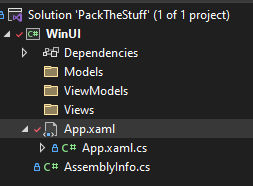

This project is a simple application that allows you to generate a list of things you need before traveling.
The main goal of the project is to present the MVVM pattern for beginners. The project will be developed and each stage will be visible on consecutive numbered branches.
the main branch will contain the final appearance of the project identical to the last branch number.
To see what changes have occurred in the project, do not forget to look at the README.md file, all changes will be described there along with the code and comments.

### Step 1 Create solution and project:
project was generated by script setup.ps1. To reproduce do following:

- open power shell and  declare projectName variable (in our case was: $projectName = "PackTheStuff")

- paste each command to: create new solution, create new wpf project, add project to solution and create git ignore by dotnet cli
- paste other command below to: change directory to Win.UI and add all needed packages

### Step 2 Adjust project content before start
- add three new folders to solution: Models, ViewModels, Views

- add new start window as our base view, by right click on Views folder and click Add -> Window (WPF)...
- set new start window in App.xaml file
```xml
<Application
    x:Class="WinUI.App"
    xmlns="http://schemas.microsoft.com/winfx/2006/xaml/presentation"
    xmlns:x="http://schemas.microsoft.com/winfx/2006/xaml"
    StartupUri="Views/PackTheStuffView.xaml">
    <Application.Resources />
</Application>
```
- remove MainWindow.xaml file
- create class PackTheStuffViewModel in ViewModel directory
- add dependency dontainer in App.xaml.cs (this is entry point of our app) by overrideing OnStaertup method like this:
```csharp
protected override void OnStartup(StartupEventArgs e)
{
    base.OnStartup(e);

    IServiceCollection services = new ServiceCollection();

    // register all services here

    services.AddSingleton<PackTheStuffViewModel>();

    IServiceProvider provider = services.BuildServiceProvider();

    Ioc.Default.ConfigureServices(provider);
}
```
- then resolve registered PackTheStuffViewModel class in PackTheStuffView code behind:
```csharp
public partial class PackTheStuffView : Window
{
    public PackTheStuffViewModel ViewModel => (PackTheStuffViewModel)this.DataContext;
    public PackTheStuffView()
    {
        InitializeComponent();
        this.DataContext = Ioc.Default.GetService<PackTheStuffViewModel>();
    }
}
```

### Results:

At this point the application should complicate and launch with a blank window. Note that ultimately this will be the only code behind that will be used in views.

### Next
